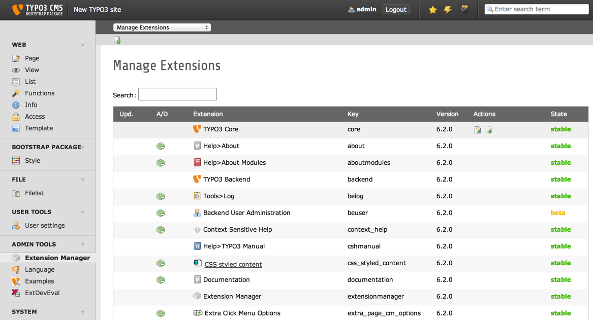

.. ==================================================
.. FOR YOUR INFORMATION
.. --------------------------------------------------
.. -*- coding: utf-8 -*- with BOM.

.. include:: ../Includes.txt

.. _admin-manual:

Administrator Manual
====================

Target group: **Administrators**

This extension is easy to install and to configure.
There are no dependencies to other extension, only to TYPO3 core.

.. _admin-installation:

Installation
------------

To install the extension, perform the following steps:

#. Go to the Extension Manager
#. Install the extension
#. Load the static template to your site

   Extension Manager (caption of the image)

   List of extensions within the Extension Manager also shorten with "EM" (legend of the image)

.. _admin-configuration:

Configuration
-------------

#. Copy the templates (/Resources/Private/Templates/) and layouts (/Resources/Private/Layouts/) from the extension folder to your own folder
#. Configure your new pathes in TypoScript
#. Include the TypoScript
#. Style the output like you want it

.. _admin-faq:

FAQ
---

Is it possible to use my own templates?
^^^^^^^^^^^^^^^^^^^^^^^^^^^^^^^^^^^^^^^^
Yes, please copy the templates from the extension to your own folder (e.g. /fileadmin/sites/etc/myTemplates/) and configure the path in the TypoScript of the extension. See also step 1 and 2 in configuration.
