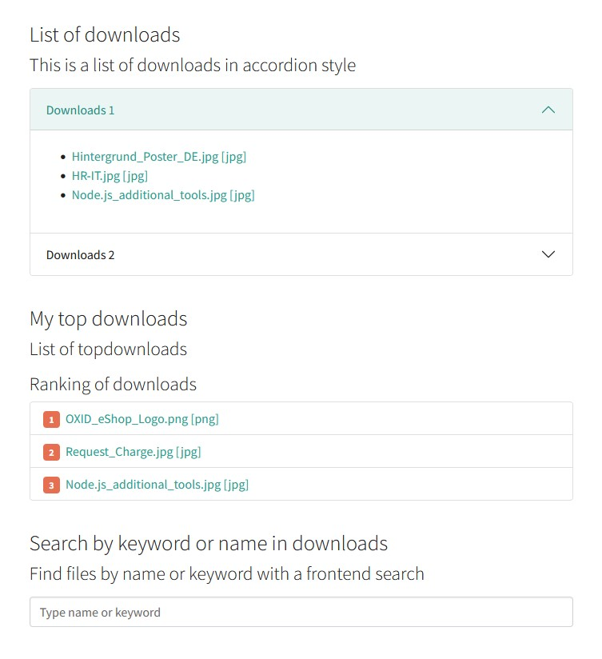

.. ==================================================
.. FOR YOUR INFORMATION
.. --------------------------------------------------
.. -*- coding: utf-8 -*- with BOM.

.. include:: Includes.txt

.. _start:

=============================================================
Download manager
=============================================================

.. only:: html

	:Classification:
		reint_downloadmanager

	:Version:
		release

	:Language:
		en

	:Description:
		A simple TYPO3 download manager with different views of file collections as downloadable lists.

	:Keywords:
		FAL,file,download,manager,collection,top10,downloads

	:Copyright:
		2022

	:Author:
		Ephraim Härer

	:Email:
		ephraim.haerer@renolit.com

	:License:
		This document is published under the Open Content License
		available from https://www.opencontent.org/

	:Rendered:
		|today|

	The content of this document is related to TYPO3,
	a GNU/GPL CMS/Framework available from `www.typo3.org <https://www.typo3.org/>`_.

	**Table of Contents**

.. toctree::
	:maxdepth: 5
	:titlesonly:
	:glob:

	Introduction/Index
	User/Index
	Administrator/Index
	Configuration/Index
	Developer/Index
	KnownProblems/Index
	ToDoList/Index
	ChangeLog/Index

Screenshots
-----------

Examples for the **list**, **top downloads** and **search** view you can see here:

   List, top downloads and search view

   The list, top downloads and search view of file collections as simple accordion.

-----------
