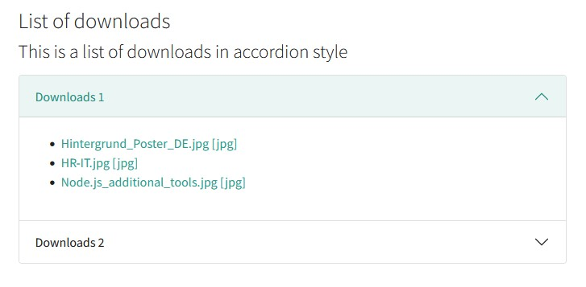
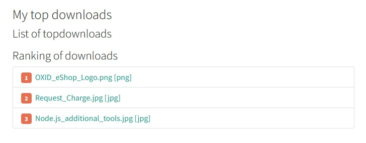
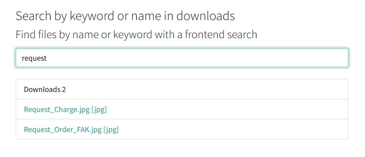

.. ==================================================
.. FOR YOUR INFORMATION
.. --------------------------------------------------
.. -*- coding: utf-8 -*- with BOM.

.. include:: ../Includes.txt

.. _introduction:

Introduction
============

.. _what-it-does:

What does it do?
----------------

This extension provides a simple output for TYPO3 default file collections which can be defined in the TYPO3 backend.

There are three views available: **list**, **top downloads** and **file search**.

The file search uses the **file title**, the **file extension** and the **file keywords** to search for a file. Keywords from file metadata can also be used to extend the file search if the extension **filemetadata** is installed.

E.g. if a file title has not the keyword to find a file in the search you can add special keywords via meta data of the file.

The download manager can handle multiple files and multiple file collections and all the views are cached (but it is not tested with millions of files ;-)).

The extension is compatible with `EXT:fal_securedownload <https://extensions.typo3.org/extension/fal_securedownload>`_ and file access could be defined via fe_user groups.

The basic templates of the views are build for the `frontend toolkit Bootstrap 5 <https://getbootstrap.com>`_;
you can use the extension for example with `EXT:bootstrap_package <https://extensions.typo3.org/extension/bootstrap_package>`_.

.. _screenshots:

Screenshots
-----------

   List view

   View of the downloads as list with accordion

-----------

   Top downloads view

   View of the top downloads

-----------

   File search

   The file search done with Vanilla JavaScript in frontend
