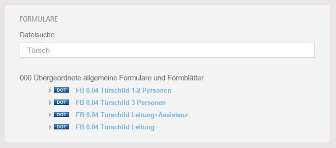

.. ==================================================
.. FOR YOUR INFORMATION
.. --------------------------------------------------
.. -*- coding: utf-8 -*- with BOM.

.. include:: ../Includes.txt

.. _introduction:

Introduction
============

.. _what-it-does:

What does it do?
----------------

This extension provides a simple output for file collections which can be defined in the TYPO3 backend.

There are three views available: **list**, **top downloads** and **file search**.

The file search uses the **file title**, the **file extension** and the **file keywords** to search for a file. Keywords from file metadata can only be used to extend the file search if the extension **filemetadata** is installed.

E.g. if a file title has not the keyword to find a file in the search you can add special keywords via meta data of the file.

The download manager can handle multiple files and multiple file collections and all the views are cached, but it is not tested with thousands of files ;-).

.. _screenshots:

Screenshots
-----------

Examples for the **list** and **top downloads** view you can see here:

.. figure:: ../Images/Introduction/frontend_collection_example.png
   :width: 500px
   :alt: List view

   List view

   The list view of file collections as simple accordion.

-----------

   Top downloads view

   View of the top downloads

-----------

   File search

   The file search done with jQuery Mobile filterable
