.. ==================================================
.. FOR YOUR INFORMATION
.. --------------------------------------------------
.. -*- coding: utf-8 -*- with BOM.

.. include:: ../Includes.txt

.. _user-manual:

Users Manual
============

Target group: **Editors**

Go to the page you want to insert the plugin and add a new content element;
you can find the download manager plugins in the "special elements" section of the new content element wizard.

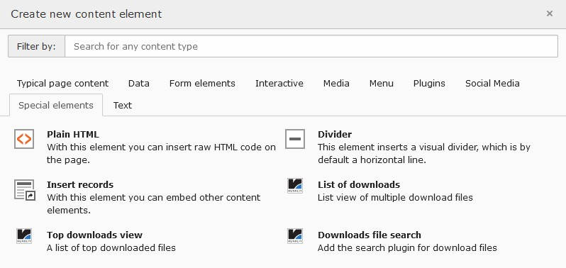

   Add new content element

   Add new content element with the wizard

.. tip::

   1. Add a subfolder for the file collections and the download counter, e.g "My file collection"

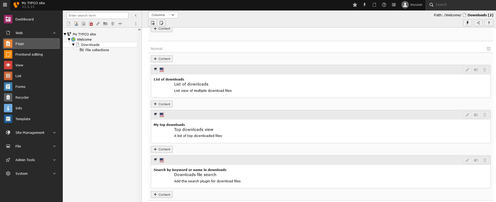

   Collection subfolder

   Add a subfolder for the file collections and the download counter

.. tip::

   2. Add file collections to the subfolder

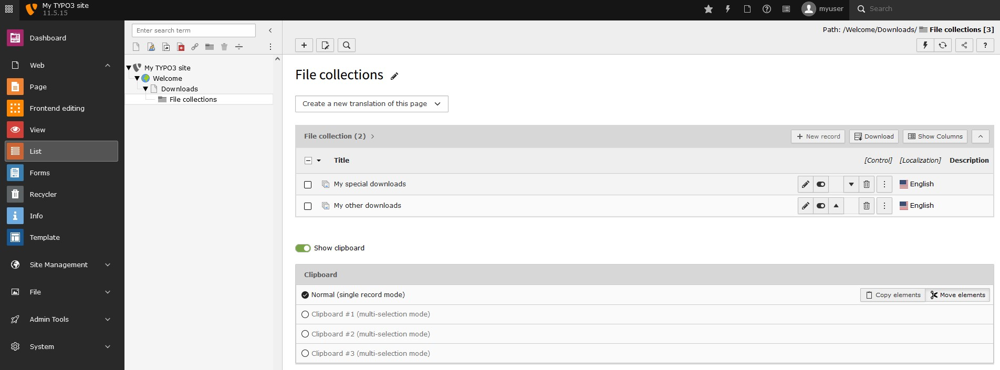

   Create file collections in folder

   Create file collections in the added subfolder

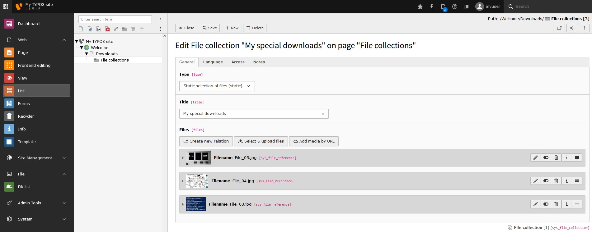

   Adding files

   Adding files to a file collection

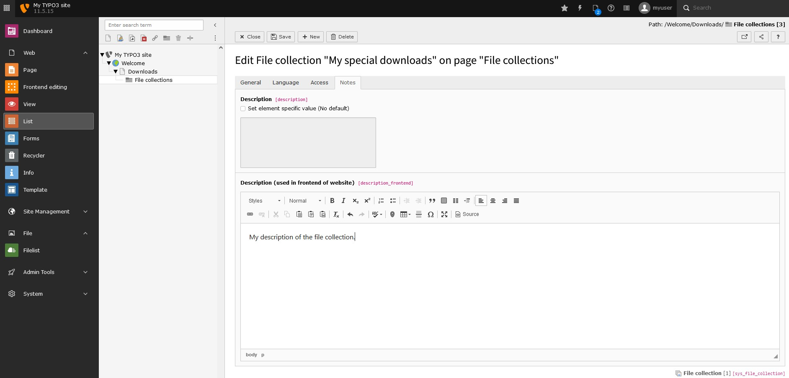

   Adding description

   Adding a description to a file collection

.. tip::

   3. Insert the **download manager** plugin(s)

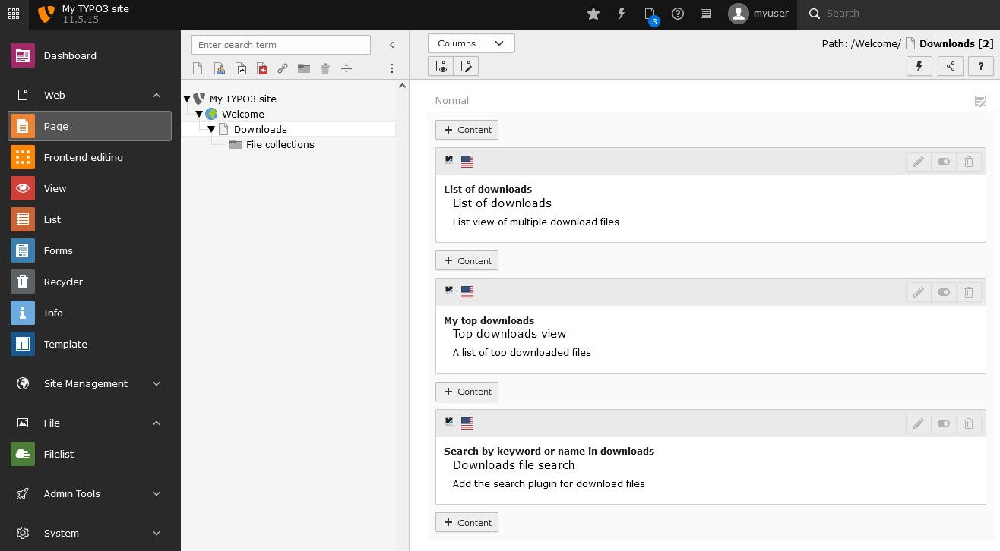

   Insert plugin

   Insert one or multiple plugins on the page you want to have the output

.. tip::

   4a. Configure the list view

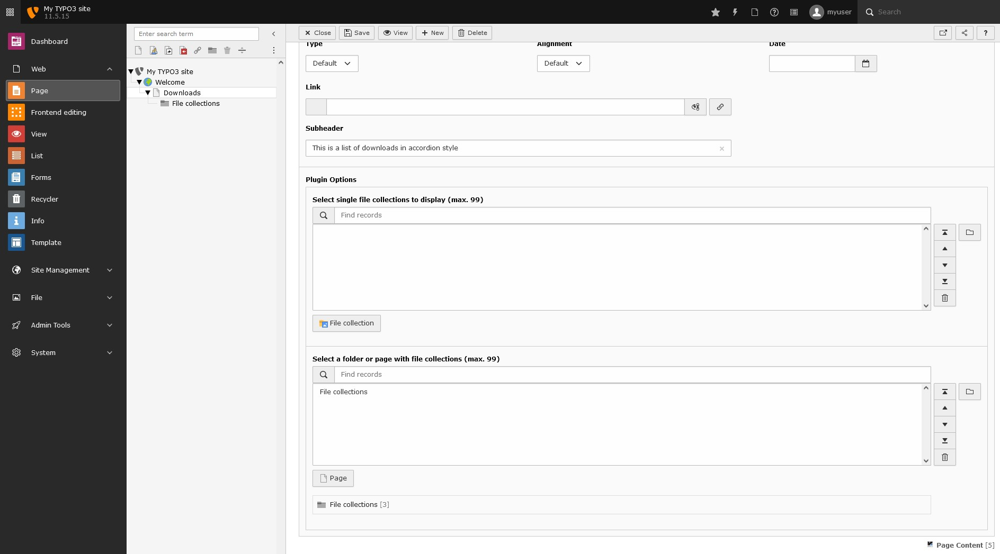

   List view

   Configuration of the list view

.. tip::

   4b. Configure the top downloads view

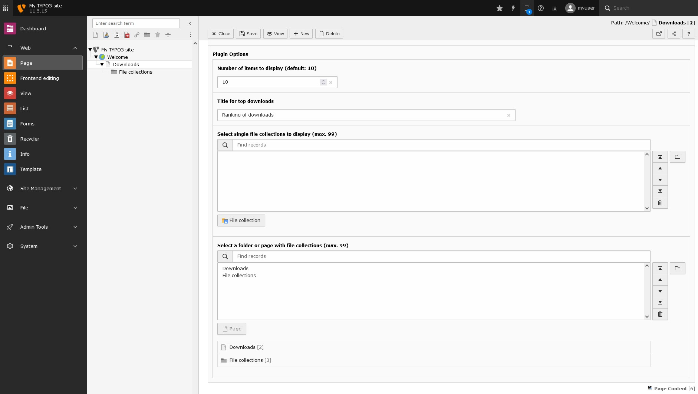

   Top downloads view

   Configuration of the top downloads view

.. tip::

   4c. Configure the file search

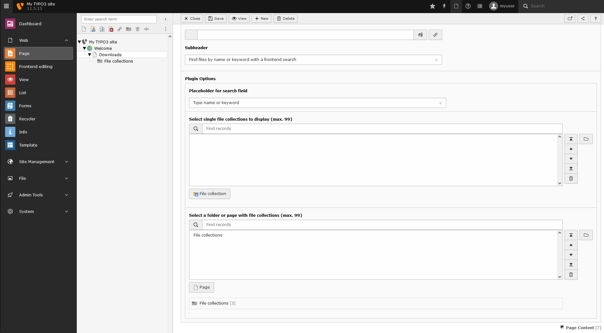

   Top downloads view

   Configuration of the top downloads view

.. tip::

   5. Add keywords to the files

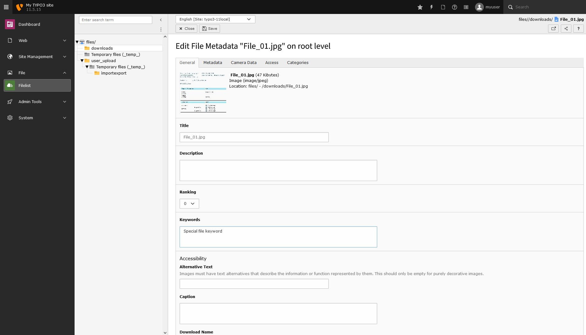

   Add keywords

   Add keywords to the files (separated by whitespaces), to add more content to search for (needs extension "typo3/cms-filemetadata" installed). The default search is only for the title of the file.

.. important::

   Select the records or single file collections to display

Select single file collections to display or select a folder or page with file collections.
The number of downloads will also stored in this page or folder.
If this is not set, the data will be saved on the page where the plugin is placed.

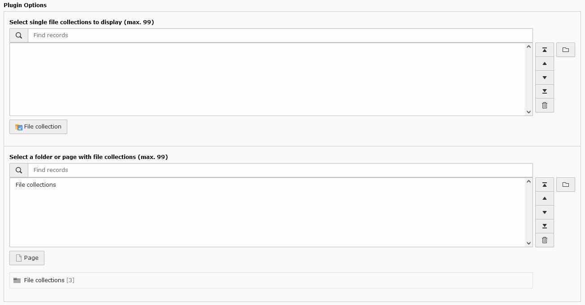

   Select file collections

   How to select file collections or folders with file collections

.. _user-faq:

FAQ
---
Is it possible to set the ordering of the collections?
^^^^^^^^^^^^^^^^^^^^^^^^^^^^^^^^^^^^^^^^^^^^^^^^^^^^^^^^^^^^^
Yes, since version 1.0.1. Please use the sorting option in TYPO3 backend to order your collections in a folder.
If you have selected single file collections, you can order them in the plugin field.

.. _user-gethelp:

Get help
--------
If there are any other questions, please contact me (ephraim.haerer@rebnolit.com) or write an issue/request on `Github <https://github.com/Kephson/reint_downloadmanager>`_.
