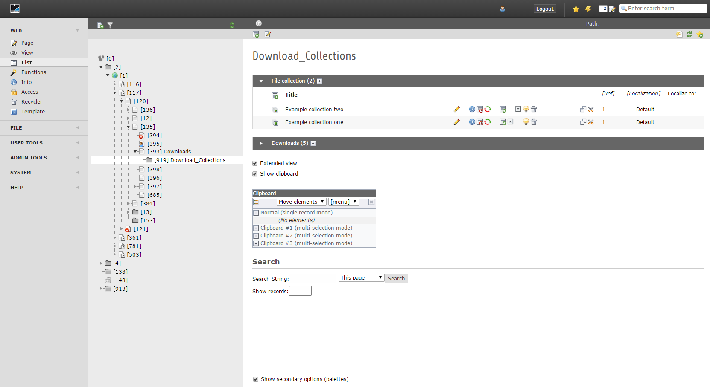
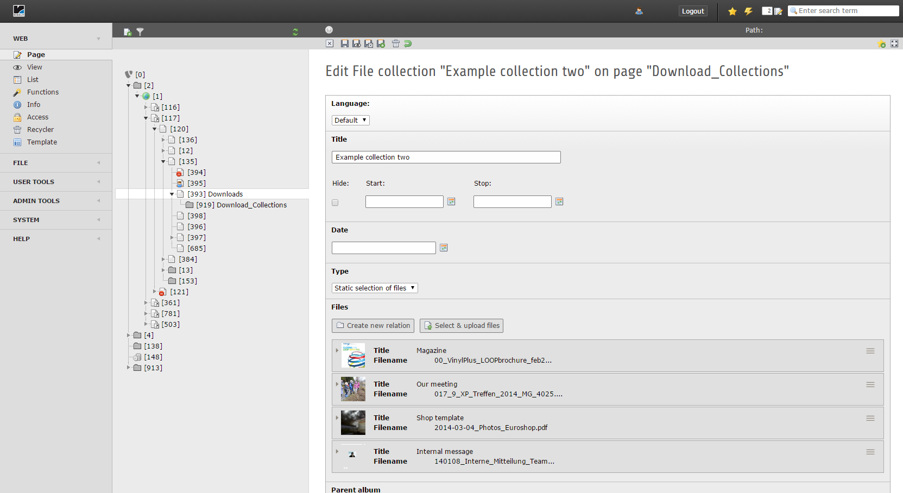
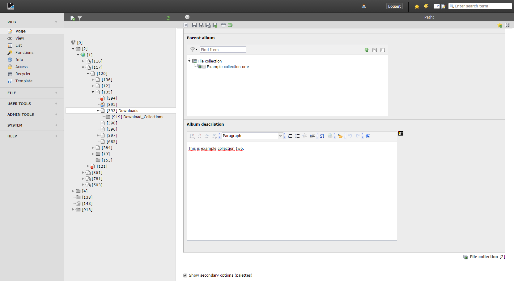
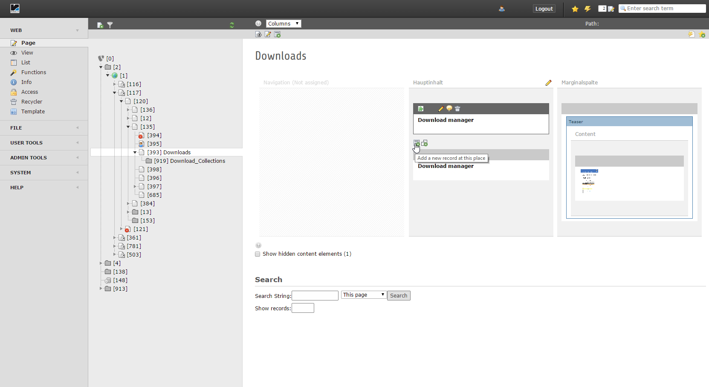
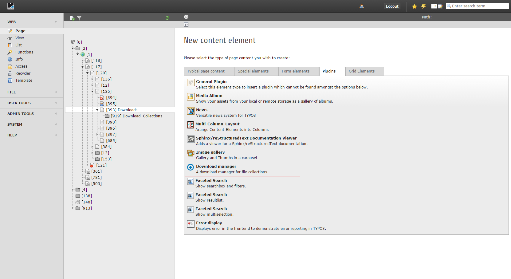
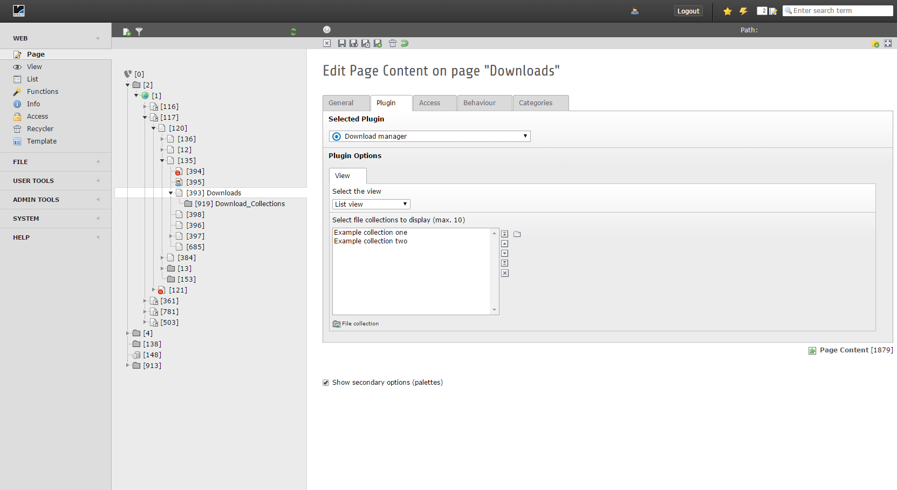
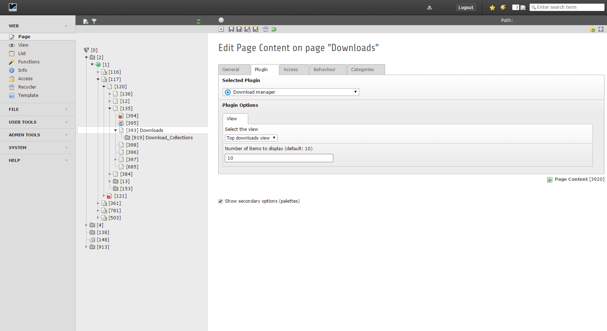
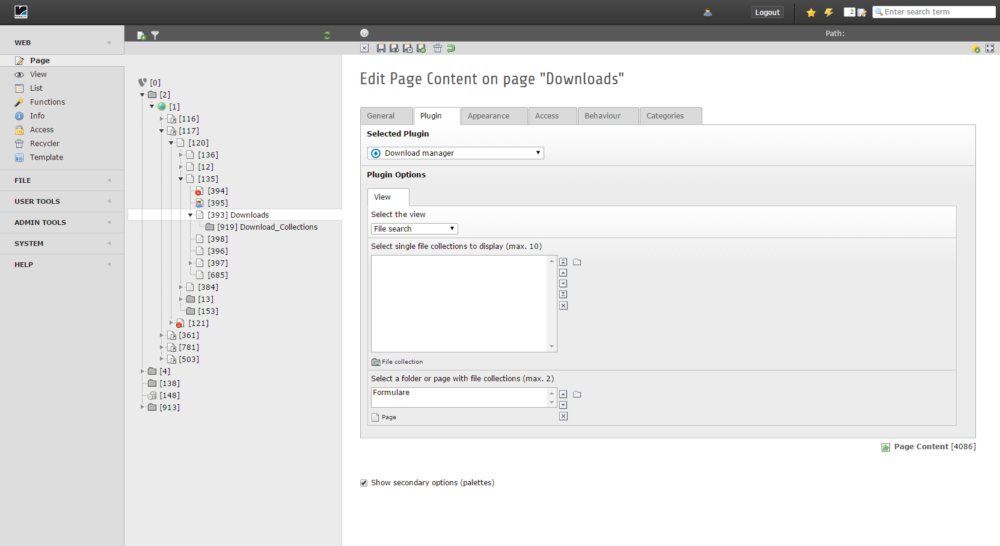
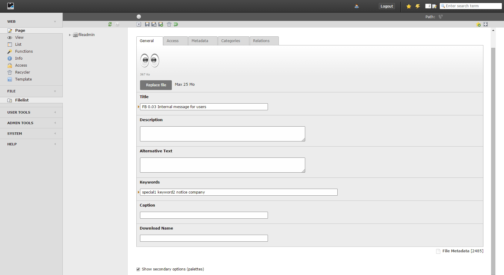
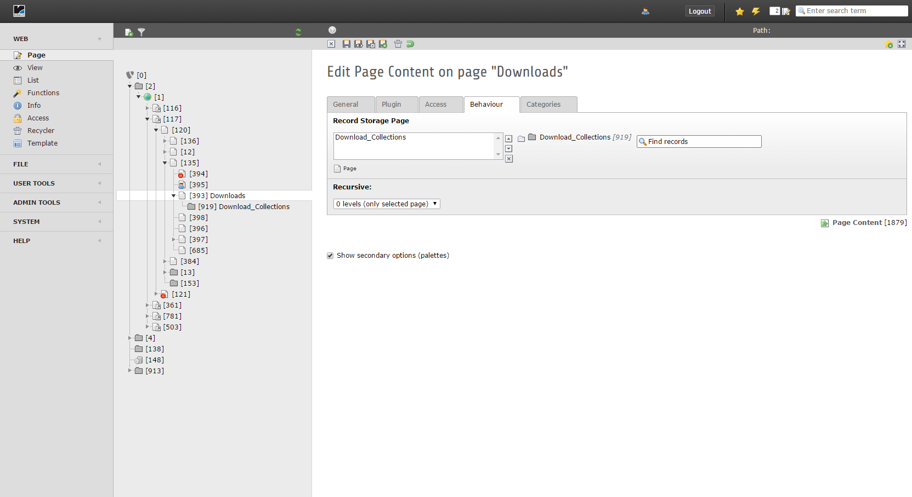

.. ==================================================
.. FOR YOUR INFORMATION
.. --------------------------------------------------
.. -*- coding: utf-8 -*- with BOM.

.. include:: ../Includes.txt

.. _user-manual:

Users Manual
============

Target group: **Editors**

Go to the page you want to insert the plugin and add a new content element which you can find under plugins, it is called **Download manager**.

.. tip::

   1. Add a subfolder for the file collections and the download counter

.. figure:: ../Images/User/typo3_backend_example.png
   :width: 800px
   :alt: collection subfolder

   Collection subfolder

   Add a subfolder for the file collections and the download counter

.. tip::

   2. Add file collections to the subfolder

   List view with file collections

   List view with file collections which are added to the subfolder

   Adding images

   Adding images to a file collection

   Adding description

   Adding description to a file collection

.. tip::

   3. Insert the **download manager** plugin

   Insert plugin

   Insert the plugin on the page you want the output

   Insert plugin

   Insert the plugin with the wizard

.. tip::

   4a. Configure the list view

   List view

   Configuration of the list view

.. tip::

   4b. Configure the top downloads view

   Top downloads view

   Configuration of the top downloads view

.. tip::

   4c. Configure the file search

   Top downloads view

   Configuration of the top downloads view

.. tip::

   5. Add keywords to the files

   Add keywords

   Add keywords to the files (separated by whitespaces), to add more content to search for (needs extension filemetadata installed). The default search is only for the title of the file.

.. important::

   Set the record storage page(s) in the tab behaviour

Set the record storage page(s) in the tab **behaviour** of the plugin to say 
the plugin where to store the download statistics or from where to get the 
download statistics. 
If this is not set, the data will be saved on the page where the plugin is set.

   Record storage page(s)

   How to set the record storage page(s)

.. _user-faq:

FAQ
---

If there are any questions, please contact me (ephraim.haerer@rebnolit.com) or write an issue/request on `Github <https://github.com/Kephson/reint_downloadmanager>`_.
